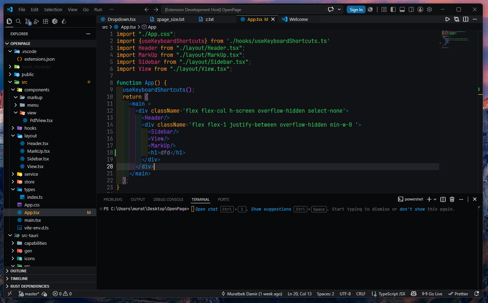

<h1 align="center">Alpic Space Theme</h1>

This VS Code theme is designed for programmers who care about their eye health. The dark blue theme features a calmer colour scheme. It minimises distractions and helps programmers focus on their projects.

P.S. If you like this theme, please give it 5 stars and tell other programmers about it.

## Installation

1. Open **Extensions** in VS Code (`Ctrl+Shift+X`)
2. Search for `Alpic Space Theme`
3. Click **Install**

## Preview

## License

MIT © Alpic-Space
